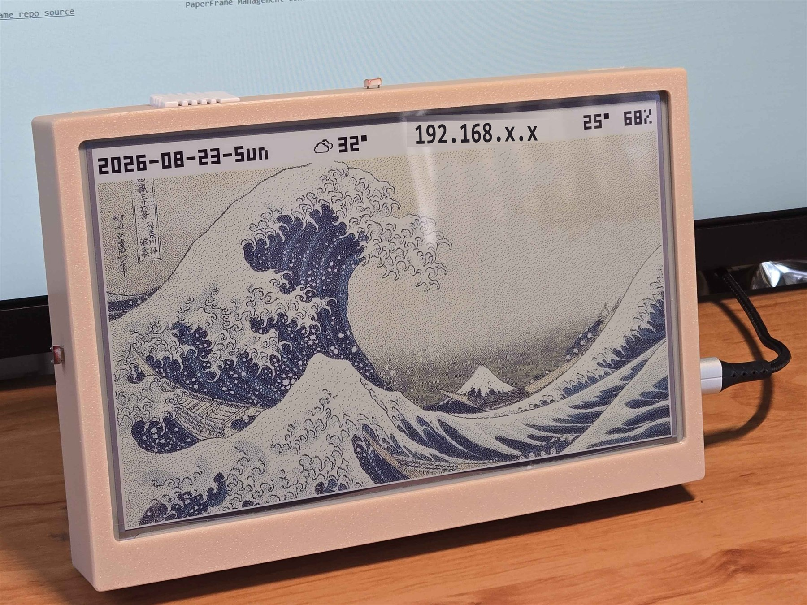
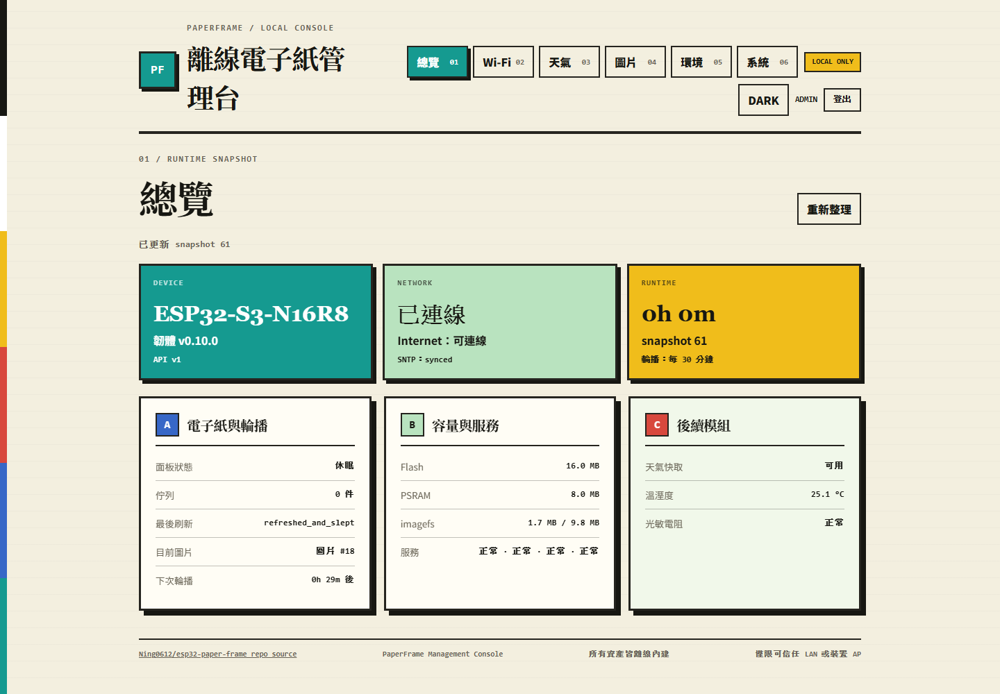
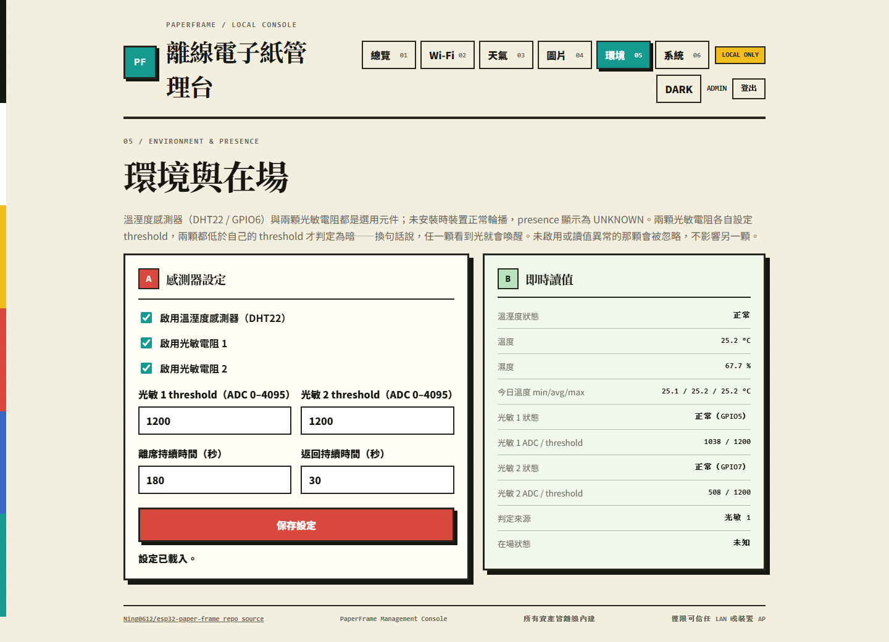
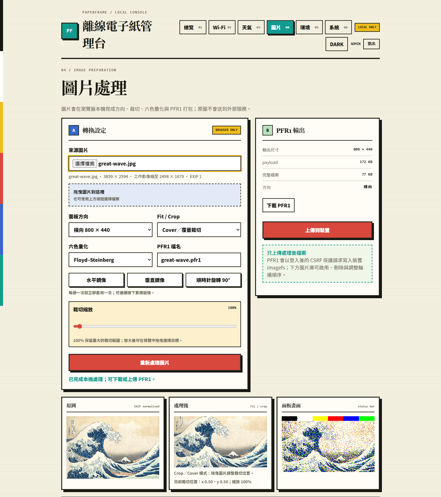
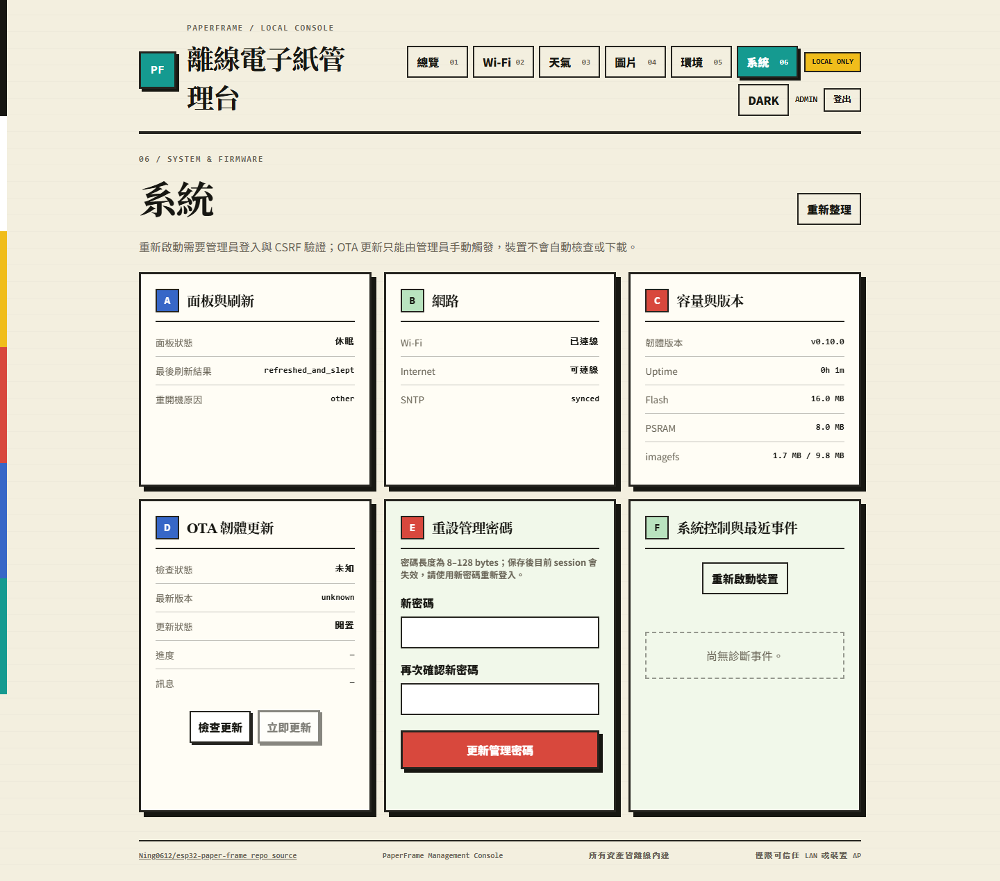
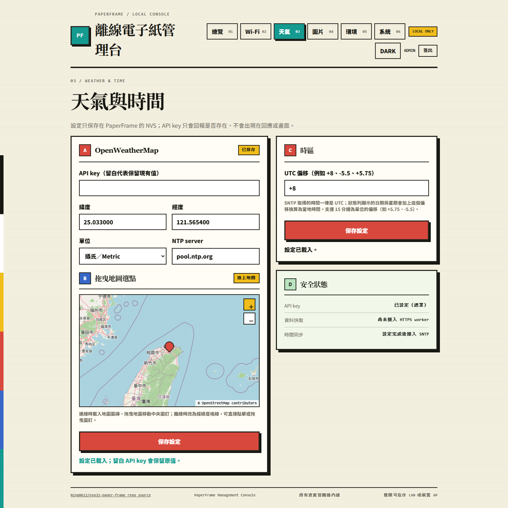

# PaperFrame

[](https://platformio.org)
[](https://www.espressif.com/en/products/socs/esp32-s3)
[](https://docs.espressif.com/projects/esp-idf/en/latest/)
[](https://github.com/Ning0612/esp32-paper-frame/releases)
[](https://github.com/Ning0612/esp32-paper-frame/actions/workflows/ci.yml)
[](LICENSE)

PaperFrame 是以 ESP32-S3 驅動 7.3 吋 800×480 E6 全彩電子紙的離線優先
圖片輪播裝置。韌體使用 PlatformIO 管理的原生 ESP-IDF，不依賴 Arduino
framework；圖片處理、設定與管理 WebUI 在區域網路或裝置 AP 內即可運作。



上圖是實機外觀。狀態列由左至右是日期與星期、目前天氣、裝置 IP（畫面中已
遮蔽）與 DHT22 的室內溫溼度；下方是輪播中的圖片。外殼 CAD 一併收錄於
[`hardware/enclosure/`](hardware/enclosure/)，也附在每個 release 的 assets。

> **與其他 e-paper 專案的關係**
>
> PaperFrame 與 [epaper-home-display](https://github.com/Ning0612/epaper-home-display)
> （Raspberry Pi 多資訊智慧家庭面板）、[pico-paper-clock](https://github.com/Ning0612/pico-paper-clock)
> （Pico W／MicroPython 桌面時鐘）是**各自獨立維護的不同專案**，硬體平台、
> 韌體堆疊與用途都不同，彼此沒有取代關係。本專案的定位是 ESP32-S3 上的
> 離線優先全彩圖片輪播。
>
> 設計上借鑑了上述兩者與 [esp32-hydracup](https://github.com/Ning0612/esp32-hydracup)
> 的既有經驗（低記憶體串流、交易式檔案更新、FreeRTOS owner 邊界等），
> 採用的來源版本固定於 [參考來源與授權](docs/REFERENCES.md)。

## 管理介面

WebUI 全部資產（HTML／CSS／JS／字型）都 gzip 後編進 app 韌體，不連任何
CDN 或雲端後端；一次 OTA 會同時更新韌體與前端
（[ADR-0016](docs/adr/0016-embed-webui-assets-in-firmware.md)）。以下截圖取自
執行 v0.10.0 的實機。

| 總覽 | 環境與在場 |
| --- | --- |
| [](docs/media/webui-dashboard.png) | [](docs/media/webui-sensors.png) |
| 面板狀態、輪播進度、容量與各服務健康度，全部來自單一 runtime snapshot。 | 兩顆光敏電阻各自設定 threshold 與即時讀值，並標示這次判定由哪一顆決定。 |

| 圖片處理 | 系統與韌體 |
| --- | --- |
| [](docs/media/webui-images.png) | [](docs/media/webui-system.png) |
| 方向、裁切、六色量化與 PFR1 打包都在瀏覽器本機完成，原圖不會送到外部服務。 | 面板與網路狀態、容量與版本、OTA 更新、重設管理密碼與診斷事件。 |

[](docs/media/webui-weather.png)

天氣與時間頁：OpenWeatherMap 座標可直接在地圖上拖曳選點，離線時同一個
控制項改成經緯度格線；API key 只回報「是否已設定」，不會出現在任何回應或
畫面上。截圖中的座標是台北，不是實際部署位置。

## 目前狀態

目前狀態的唯一進度入口是 [專案狀態](docs/PROJECT_STATUS.md)，實機證據在
[硬體驗證紀錄](docs/hardware/VALIDATION.md)。摘要如下：

| 分類 | 目前結論 |
| --- | --- |
| 已完成 | Phase 1–8 的程式、host tests 與韌體 build 全部完成。 |
| 已實機驗證 | Phase 2–8 的實機證據已閉環：面板刷新與 sleep 電流、AP／STA 配網與存取邊界、browser 出圖管線、五種斷電路徑、天氣四種失敗分類、OTA 端到端與 rollback fault injection，以及 Phase 7 的 DHT22、雙光敏通道與在場判定。 |
| 待驗證 | 只剩三個低優先項：`SensorSettings` v1→v2 的實機遷移路徑、AP grace 的 presence 例外與低 DMA heap guard、NVS 滿導致 `pf_config` 開啟失敗。 |
| 待決定 | production security profile（Secure Boot／Flash Encryption）與 MVP 以外的 P1 功能尚未納入開發。 |

已知遺留缺陷（有記錄、尚未修）：`DisplayOutcome` 把「畫面已刷上去」與
「面板已成功 sleep」混為一談，sleep 失敗時會重刷一張已經正確的畫面；影響
已由 welcome 重試的指數退避壓制，正確修法需取代 ADR-0003 的 driver contract，
見 [ADR-0015 的 2026-08-23 Update](docs/adr/0015-first-image-waits-for-ntp-and-weather.md)。

Secure Boot 與 Flash Encryption 尚未啟用，所以這**不是**可直接放到不可信任
網路的產品；設計前提是可信任 LAN 或裝置自身的 AP。

## 功能

括號內是**實機驗證狀態**。逐項證據以 [專案狀態](docs/PROJECT_STATUS.md) 與
[硬體驗證紀錄](docs/hardware/VALIDATION.md) 為準。

- **離線優先圖片輪播**：區網或裝置 AP 內即可完成全部操作，不依賴外部 CDN
  或後端服務（已驗證，含長時間輪播）
- **PFR1 自有圖片格式**：瀏覽器端完成量化與打包，裝置只負責解碼與顯示，
  避免在 MCU 上做重量級影像處理（已驗證：browser 出圖、上傳與下載）
- **交易式 imagefs 儲存**：圖片分區與韌體分區分離，OTA 更新不會清除既有圖片
  （已驗證，含五種斷電路徑的故障注入）
- **管理 WebUI**：Dashboard、圖片管理、Wi-Fi、天氣、環境與 System 診斷頁
  （已驗證：瀏覽器實機操作）
- **配網與認證**：AP portal 配網，blank-NVS 與 STA 重試耗盡時自動 fallback AP；
  PBKDF2 10,000 iterations、session 與 CSRF 保護（已驗證：存取邊界與認證邊界）
- **OTA 更新與 rollback**：以 GitHub Releases 為來源，A/B 分區與 rollback
  確認機制（已驗證：端到端更新與 rollback fault injection）
- **天氣資訊**：解析、快取與面板狀態列顯示（已驗證：真實 SNTP 與四種失敗分類）
- **可選環境感測**：DHT22 溫溼度與兩個獨立的光敏電阻通道。兩顆都低於各自
  threshold 才判定為暗、任一顆見光就喚醒；含移動平均濾波、離席／返回防抖與
  離席白屏（已驗證：讀值、拔除降級、雙通道校正、AND 語意與 180／30 秒防抖計時）

## 文件入口

請先讀 [文件入口與分類](docs/README.md)；若只想知道現在做到哪裡，讀
[專案狀態](docs/PROJECT_STATUS.md)。ADR、current contract、硬體證據與歷史
計畫的權威關係都集中在該入口說明，不需要從所有文件開始閱讀。

## 開源快速開始

開發環境需要 Windows 11、Python 3.13、PlatformIO Core 6.1.19 與原生 ESP-IDF。
在乾淨 checkout 中執行：

```powershell
uv venv --seed --python 3.13 .venv
uv pip install --python .\.venv\Scripts\python.exe -r requirements-dev.txt
.\.venv\Scripts\pio.exe test -e native
.\.venv\Scripts\pio.exe run
```

`native` 是不需要硬體的 host test；韌體 upload、面板、Wi-Fi、NVS、OTA 與
斷電復原則依 [燒錄操作](docs/hardware/FLASHING.md)、[硬體驗證紀錄](docs/hardware/VALIDATION.md)
與 [release checklist](docs/RELEASE_CHECKLIST.md) 執行。請勿把 host/build 結果
當成實機驗證。

**拿到全新板子時，`pio run -t upload` 不足以讓它開機**：日常上傳只寫 app slot，
不含 bootloader。首次燒錄與 bootloader 更新見
[新裝置首次燒錄](docs/hardware/FLASHING.md#新裝置首次燒錄含-bootloader)；
OTA 的回滾保護取決於 bootloader 版本，判斷方式見
[bootloader 是否具備回滾保護](docs/hardware/FLASHING.md#bootloader-是否具備回滾保護)。

## 硬體

完整元件清單、接線與腳位限制見 [硬體規格與接線](docs/hardware/HARDWARE.md)；
腳位分配的決策與理由固定在 [ADR-0003](docs/adr/0003-fix-phase2-display-integration.md)。
以下為常用摘要。

| 類別 | 元件 | 狀態 |
| --- | --- | --- |
| 主控 | ESP32-S3-N16R8（16 MB Flash、8 MB octal PSRAM） | 必要 |
| 顯示器 | Waveshare 7.3 吋 e-Paper HAT (E)，800×480 E6 六色 | 必要 |
| 溫溼度 | DHT22／AM2302 | 可選；已實機驗證 |
| 光感測 | 光敏電阻＋分壓 ×2，接 `ADC1_CH4` 與 `ADC1_CH6` | 可選（可只接一顆）；已實機驗證 |
| 外殼 | 3D 列印，CAD 見 [`hardware/enclosure/`](hardware/enclosure/) | 可選 |

顯示器接線（3.3 V logic、SPI2、mode 0、MSB-first、起始 clock 2 MHz）：

| HAT | DIN | CLK | CS | DC | RST | BUSY |
| --- | --- | --- | --- | --- | --- | --- |
| ESP32-S3 | GPIO11 | GPIO12 | GPIO10 | GPIO13 | GPIO14 | GPIO4 |

感測器腳位：光敏 ADC 通道 1 = GPIO5（`ADC1_CH4`）、DHT data = GPIO6、光敏 ADC
通道 2 = GPIO7（`ADC1_CH6`）；GPIO8／GPIO9 保留給未來 I²C。兩個光敏通道都必須
在 ADC1——ADC2 在 Wi-Fi 啟用時由 Wi-Fi driver 佔用。分壓接法、極性與校正流程見
[硬體與接線](docs/hardware/HARDWARE.md)，合併判定規則見
[ADR-0018](docs/adr/0018-dual-photoresistor-channels.md)。**改接線前務必先讀 ADR-0003 的腳位限制**——octal PSRAM 佔用
GPIO33–37、native USB 佔用 GPIO19–20，GPIO0／3／45／46 是 strapping pins，
GPIO4 已給 BUSY 不得再作 ADC。

### 外殼

[`hardware/enclosure/`](hardware/enclosure/) 收錄桌上型相框外殼，每個零件同時
提供 **STEP（AP214）** 與 **STL**：STEP 用來改尺寸或重新出圖，STL 直接送切片
軟體。零件清單、量到的外接方框尺寸與已知問題見
[該目錄的 README](hardware/enclosure/README.md)。同一份內容也會以
`paperframe-enclosure.zip` 附在每個 GitHub Release 的 assets。

## 架構概覽

韌體拆成 12 個 ESP-IDF component，`src/app_main.cpp` 只負責啟動與接線。
跨 component 的協調集中在 `pf_runtime` 的 `RuntimeCoordinator`：顯示、儲存、
網路與 OTA 各自有明確的 owner，彼此以訊息往來而不是共享可變狀態，避免網路或
儲存 I/O 阻塞面板刷新。

各 component 的設計理由與取捨固定在 [ADR](docs/adr/README.md)，本節只是導覽。

| Component | 職責 |
| --- | --- |
| `pf_runtime` | `RuntimeCoordinator`、runtime snapshot、diagnostics event、reboot reason、韌體版本 |
| `pf_display` | epd7in3e driver（SPI2）、DisplayTask、owner contract |
| `pf_carousel` | 輪播排程、image frame 與 welcome frame |
| `pf_image` | PFR1 格式解碼 |
| `pf_storage` | LittleFS backend、image store、catalog、transaction 與 recovery、storage worker |
| `pf_network` | AP／STA 狀態機、配網服務、掃描結果、SNTP 時間同步 |
| `pf_web` | HTTP server、Dashboard／health serializer、各設定表單、access policy |
| `pf_auth` | PBKDF2 密碼驗證、session 與 CSRF |
| `pf_config` | NVS 設定 schema、憑證與 secure memory |
| `pf_ota` | GitHub Releases 下載、A/B 分區與 rollback 確認 |
| `pf_weather` | 天氣解析、快取與 worker |
| `pf_sensors` | DHT22 與光敏 ADC driver、濾波與 presence 判定 |

測試分兩層：`test/` 是不需要硬體的 host test（`pio test -e native`），
`test_embedded/` 是需要實機的 on-target test。**host test 通過不等於實機驗證**，
兩者的分界與現況見 [硬體驗證紀錄](docs/hardware/VALIDATION.md)。

## 公開基線與已知限制

- 目標基線是 ESP32-S3-N16R8、16 MB Flash、8 MB octal PSRAM 與 7.3 吋
  800×480 E6 全彩電子紙；光敏與溫溼度感測器是可選周邊（見上方硬體段）。
- WebUI 與圖片管理以離線優先為原則，不依賴外部 CDN 或後端服務。
- 電子紙完整刷新預設 30 分鐘、下限 10 分鐘，實測一次全刷約 31 秒，每次刷新
  後面板進入 sleep。這是 E6 面板的物理特性，不是可調優的軟體延遲。
- 未啟用 Secure Boot 與 Flash Encryption，僅適用於可信任 LAN 或裝置自身的 AP。
- 仍有三個低優先的實機驗證缺口（見上方目前狀態）。
- 真實裝置測試資料、裝置識別資訊與執行期 imagefs 不屬於公開 repository 內容。

## 開發基線

- Windows 11 / PowerShell 7
- [uv](https://docs.astral.sh/uv/getting-started/installation/) 0.11.26
- Python 3.13 project venv
- PlatformIO Core 6.1.19
- PlatformIO Espressif 32 platform（版本由 Phase 1 build 固定）
- Native ESP-IDF

上列是實際使用並通過 build 的組合。**Linux 與 macOS 未測試**——工具鏈本身跨平台，
但本專案的指令範例、`uv` 路徑與燒錄流程都以 Windows 為準，其他平台需自行調整。
CI 在 `ubuntu-latest` 上跑 host test 與韌體 build，所以程式本身可在 Linux 編譯，
未測試的是本文件描述的 Windows 操作流程。

建立工具環境：

```powershell
uv venv --seed --python 3.13 .venv
uv pip install --python .\.venv\Scripts\python.exe -r requirements-dev.txt
.\.venv\Scripts\pio.exe --version
```

韌體的標準 build、native USB 單命令 upload 與 port 盤點命令：

```powershell
.\.venv\Scripts\pio.exe run
.\.venv\Scripts\pio.exe run -e paperframe-s3 -t upload
.\.venv\Scripts\pio.exe device list
```

標準 upload 會依 VID:PID `303A:1001` 自動選擇 ESP32-S3 native USB，以
`usb_reset` 進入 ROM，讀取 `otadata` 後更新目前啟動的 OTA app slot，完成後
自動重置。首次、RGB demo 或 app 損壞無法自動 reset 時，才需在 reset 同時拉低
GPIO0、GPIO46。完整安全步驟、app-only slot 限制與測試後恢復方式見
[ESP32-S3 燒錄操作](docs/hardware/FLASHING.md)。

這條路徑**不會更新 bootloader 或 partition table**——新板子的首次燒錄、以及
既有裝置要取得 OTA 回滾保護時的 bootloader 更新，都在同一份文件的
[新裝置首次燒錄](docs/hardware/FLASHING.md#新裝置首次燒錄含-bootloader)一節。

## 文件

- [文件入口與分類](docs/README.md)
- [專案狀態](docs/PROJECT_STATUS.md)
- [架構決策](docs/adr/README.md)
- [硬體規格與接線](docs/hardware/HARDWARE.md)
- [硬體驗證紀錄](docs/hardware/VALIDATION.md)
- [外殼 CAD](hardware/enclosure/README.md)
- [參考來源與授權](docs/REFERENCES.md)
- [歷史需求草案](docs/archive/Guild.md)

## License

本專案採用 [MIT License](LICENSE)。參考專案與未來第三方 dependency 的授權
仍需分別遵守；參考概念不代表可省略原始碼 attribution 或第三方 notice。
韌體內建的天氣圖示改繪自 erikflowers/weather-icons（SIL OFL-1.1），
attribution 見 [ASSET_CREDITS.md](ASSET_CREDITS.md) 與
[THIRD_PARTY_NOTICES.md](THIRD_PARTY_NOTICES.md)。
